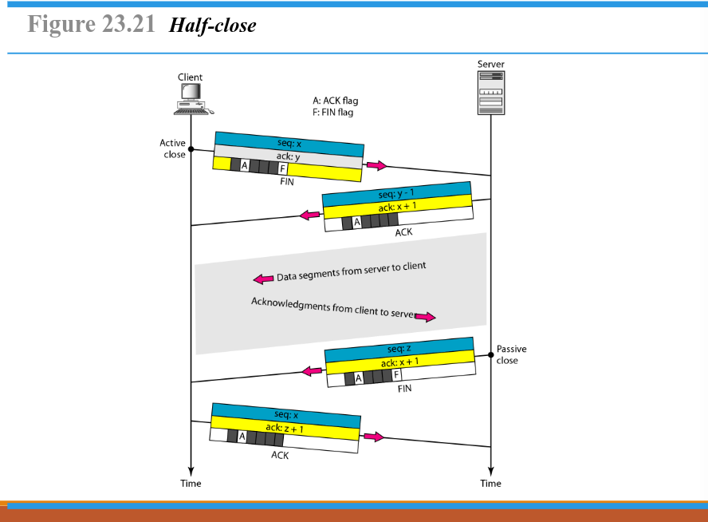

# Nama  : Muhammad Felda Hibatullah
# NRP   : 3123600023
# Kelas : 2 D4 IT A

<h1 align="center">Tugas Review Konsep Jaringan</h1>
### A. Analisa File http.cap dengan Wireshark
<ol>
  <li>
      Versi HTTP yang digunakan
      
      <ul>
        <li>
            
Pada gambar di atas dapat diketahui bahwa versi HTTP yang digunakan adalah versi HTTP/1.1

        </li>
        <li>
            
Untuk dapat mengetahui versi HTTP melalui wireshark dengan menekan packet nomor 4, kemudian klik kanan dan pilih opsi follow dan HTPP streams. Untuk melihat HTTP version dapat dilihat pada bagian client dan server pada bagian paling atas.

        </li>
      </ul>
  </li>

  <li>
      IP address dari client maupun server
      
  </li>
</ol>
<h2>B. Deskripsi Gambar Pada Slide</h2>

Pada gambar di atas dapat dijelaskan bahwa :

<ol>
  <li>
    Node to Node (Data Link Layer)
    
Pengiriman data terjadi antara dua perangkat fisik yang saling terhubung, seperti komputer atau switch, di dalam jaringan lokal.

  </li>
  <li>
    Host to Host (Network Layer)
    
Pengiriman data antara dua perangkat di luar jaringan lokal, seperti internet. Proses ini menggunakan pengalamatan dan routing data dari host ke host lainnya.

  </li>
  <li>
    Process to Process (Transport Layer)
    
Pengiriman data terjadi antara aplikasi yang berjalan pada dua sistem yang berbeda. Protokol transport, seperti TCP dan UDP, mengatur jalur komunikasi data antara dua proses di dua host yang bebeda, seperti server dan client.

  </li>
</ol>

<h2>C. Rangkuman Tahapan Komunikasi Menggunakan TCP</h2>
<ol>
  <li>
      Connection Establishment Using Three-Way Handshaking
      
      
Gambar di atas merupakan proses three-way handshake yang digunakan untuk membangun koneksi antara client dan server sebelum.

      Tahapan Three-Way handshake :
      <ul>
        <li>SYN (Synchronization Request)</li>
        <ul>
          <li>client menginisiasi koneksi dengan mengirimkan paket SYN ke server.</li>
          <li>Paket berisi sequence number untuk menandai awal komunikasi.</li>
          <li>client berdapa dalam status "Active Open", sedangkan server dalam "Passive Open".</li>
        </ul>
        <li>
          SYN-ACK (Synchronization Acknowledgment)
          <ul>
            <li>Server menerima permintaan client dan mengirim balasan yang berisi SYN + ACK.</li>
            <li>Server mengirimkan sequence number baru serta Acknowledgment number untuk mengonfirmasi penerimaan paket dari client.</li>
          </ul>
        </li>
        <li>
          ACK (Acknowledgment)
          <ul>
            <li>Client menerima balasan dari server dan mengirimkan paket ACK terakhir.</li>
            <li>Paket ini berisi acknowledgment number sebagai tanda bahwa koneksi berhasil dibuat.</li>
          </ul>
        </li>
      </ul>
  </li>
  <li>
      Data Transfer
       
      
      
Pada gambar di atas merupakan proses transfer data dalam protokol TCP setelah koneksi berhasil dibangan menggunakan three-way handshake.

      Tahapan Proses Transfer Data :
      <ul>
        <li></li>
      </ul>
  </li>
  <li>
      Connection Termination Using Three-Way Handshaking
      
      

      Tahapan Proses Data Transfer :
      <ul>
        <li>
          Pengiriman Data dar Client ke Server
          <ul>
            <li>Client mengirimkan segmen pertama dengan sequence number dan acknowledgment number.</li>
            <li>Data yang dikirimkan mencakup 8001-9000 bytes dengan flag PUSH (P) dan ACK (A).</li>
          </ul>
        </li>
        <li>
          Pengiriman Data Lanjutan
          <ul>
            <li>Client mengirimkan segmen kedua dengan sequence: 9001, ack: 15001.</li>
            <li>Data yang dikirim mencakup 9001-10000 bytes.</li>
          </ul>
        </li>
        <li>
          Balasan dari Server
          <ul>
            Server mengirimkan data dengan
          </ul>
        </li>
      </ul>
  </li>
  <li>
      Half-close
      
      

  </li>
</ol>