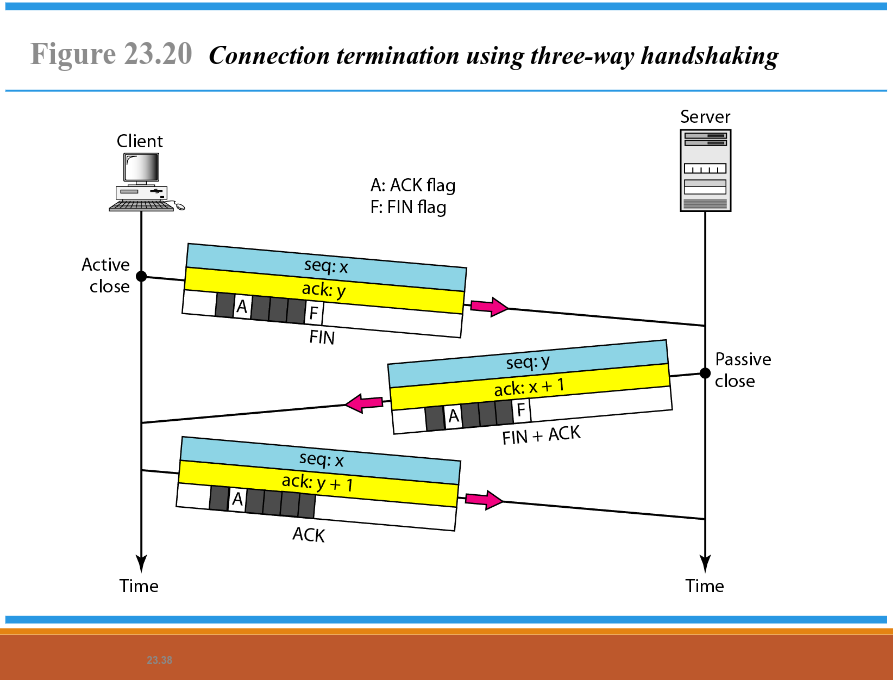

# Tugas Review Konsep Jaringan

**Nama**: Muhammad Felda Hibatullah  
**NRP**: 3123600023  
**Kelas**: 2 D4 IT A  

## A. Analisa File http.cap dengan Wireshark

### 1. Versi HTTP yang Digunakan

- Berdasarkan gambar di atas, versi HTTP yang digunakan adalah **HTTP/1.1**.
- Untuk mengetahui versi HTTP melalui Wireshark, pilih paket nomor 4, klik kanan dan pilih opsi **Follow** > **HTTP streams**. Versi HTTP dapat dilihat pada bagian client dan server di bagian paling atas.

### 2. IP Address dari Client maupun Server

## B. Deskripsi Gambar pada Slide

Pada gambar di atas dapat dijelaskan bahwa:

1. **Node to Node (Data Link Layer)**
   - Pengiriman data terjadi antara dua perangkat fisik yang saling terhubung, seperti komputer atau switch, dalam jaringan lokal.

2. **Host to Host (Network Layer)**
   - Pengiriman data antara dua perangkat di luar jaringan lokal, seperti internet, dengan menggunakan pengalamatan dan routing data.

3. **Process to Process (Transport Layer)**
   - Pengiriman data antara aplikasi yang berjalan di dua sistem yang berbeda. Protokol transport seperti TCP dan UDP mengatur jalur komunikasi data antara dua proses di dua host berbeda.

## C. Rangkuman Tahapan Komunikasi Menggunakan TCP

### 1. Connection Establishment Using Three-Way Handshaking

Proses *three-way handshake* yang digunakan untuk membangun koneksi antara client dan server:

- **SYN (Synchronization Request)**  
  Client menginisiasi koneksi dengan mengirimkan paket SYN ke server yang berisi sequence number untuk menandai awal komunikasi.

- **SYN-ACK (Synchronization Acknowledgment)**  
  Server menerima permintaan client dan mengirimkan balasan yang berisi SYN + ACK untuk mengonfirmasi penerimaan paket dari client.

- **ACK (Acknowledgment)**  
  Client mengirimkan paket ACK terakhir untuk memberi tahu bahwa koneksi berhasil dibuat.

### 2. Data Transfer

Proses transfer data setelah koneksi berhasil dibangun:

- **Pengiriman Data dari Client ke Server**  
  Client mengirimkan segmen pertama dengan sequence number dan acknowledgment number, data yang dikirimkan mencakup byte tertentu dengan flag PUSH (P) dan ACK (A).

- **Pengiriman Data Lanjutan**  
  Client mengirimkan segmen kedua dengan sequence dan acknowledgment number yang relevan.

- **Balasan dari Server**  
  Server mengirimkan data dengan sequence dan acknowledgment number sesuai dengan urutan data yang diterima.

- **Acknowledgment dari Client**  
  Client mengirimkan ACK untuk memberi tahu bahwa data telah diterima dengan baik.

### 3. Connection Termination Using Three-Way Handshaking

Proses penghentian koneksi TCP menggunakan *three-way handshake* antara client dan server:

- **Client memulai penutupan koneksi**  
  - **Client mengirimkan sinyal untuk memulai penutupan koneksi setelah transfer data selesai**.
  - Hal ini menunjukkan bahwa client tidak akan mengirim data lagi.

- ****