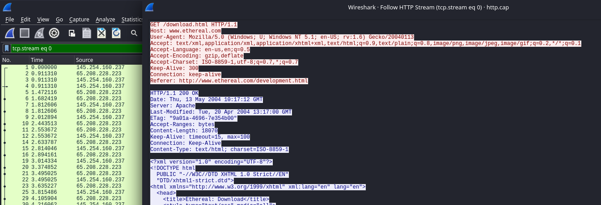
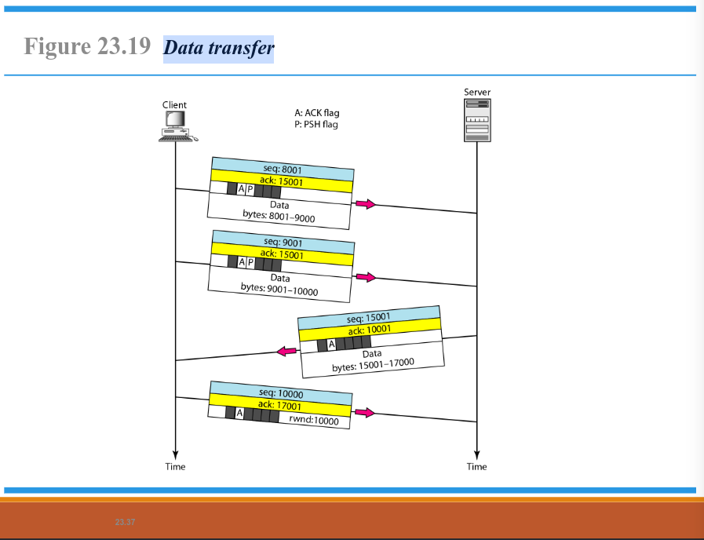

# AdminJaringan2025

hello World

A. Analisa File http.cap dengan Wireshark :

<ol>
  <li>
      Versi HTTP yang digunakan
      
      <ul>
        <li>
            
Pada gambar di atas dapat diketahui bahwa versi HTTP yang digunakan adalah versi HTTP/1.1

        </li>
        <li>
            
Untuk dapat mengetahui versi HTTP melalui wireshark dengan menekan packet nomor 4, kemudian klik kanan dan pilih opsi follow dan HTPP streams. Untuk melihat HTTP version dapat dilihat pada bagian <i>client</i> dan <i>server</i> pada bagian paling atas

        </li>
      </ul>
  </li>
</ol>

B. Deskripsi Gambar Pada Slide

Pada gambar di atas dapat dijelaskan bahwa :

<ol>
  <li>
    Node to Node (Data Link Layer)
    
Pengiriman data terjadi antara dua perangkat fisik yang saling terhubung, seperti komputer atau switch, di dalam jaringan lokal

  </li>
  <li>
    Host to Host (Network Layer)
    
Pengiriman data antara dua perangkat di luar jaringan lokal, seperti internet. Proses ini menggunakan pengalamatan dan routing data dari host ke host lainnya.

  </li>
  <li>
    Process to Process (Transport Layer)
    
Pengiriman data terjadi antara aplikasi yang berjalan pada dua sistem yang berbeda. Protokol transport, seperti TCP dan UDP, mengatur jalur komunikasi data antara dua proses di dua host yang bebeda, seperti server dan clien

  </li>
</ol>

C. Rangkuman Tahapan Komunikasi Menggunakan TCP

<ol>
  <li>
      Connection Establishment Using Three-Way Handshaking
      
      

  </li>
  <li>
      Data Transfer
      
      

  </li>
  <li>
      Connection Termination Using Three-Way Handshaking
      
      

  </li>
  <li>
      Half-close
      
      

  </li>
</ol>